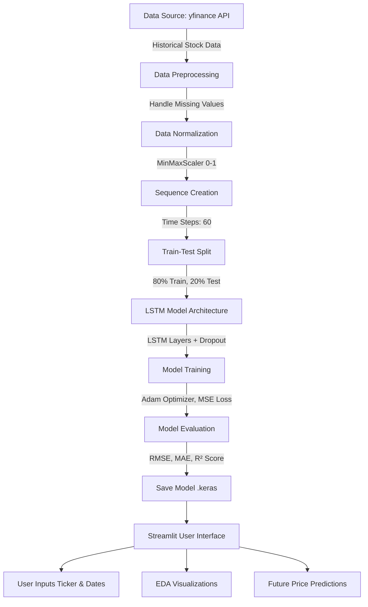

# Project Report: Stock Market Price Prediction System using Deep Learning

## 1. Project Architecture Diagram

## 2. Dataset Description
The dataset is dynamically fetched using the `yfinance` API, which provides real-time and historical data from Yahoo Finance.
*   **Source:** Yahoo Finance API (`yfinance`)
*   **Features:**
    *   `Date`: The trading date.
    *   `Open`: The opening price of the stock.
    *   `High`: The highest price of the stock during the trading day.
    *   `Low`: The lowest price of the stock during the trading day.
    *   `Close`: The closing price of the stock (Target Variable).
    *   `Volume`: The number of shares traded.

## 3. Methodology
1.  **Data Collection:** Historical data is retrieved for a specific ticker (e.g., AAPL) over a given period (e.g., 2015 to Present).
2.  **Data Preprocessing:** Missing values are handled using forward-fill and backward-fill mechanisms to maintain continuity in time-series data.
3.  **Feature Scaling:** The `Close` price is normalized to a range of 0 to 1 using `MinMaxScaler` to ensure stable convergence of the neural network during training.
4.  **Sequence Generation:** Time-series sequences are created using a lookback period (e.g., 60 days). The model uses the past 60 days to predict the 61st day.
5.  **Model Building:** A multi-layer Long Short-Term Memory (LSTM) network is built. The LSTM cells are designed to capture long-term dependencies in the sequential data. Dropout layers (20%) are added to prevent overfitting.
6.  **Training:** The model is compiled using the Adam optimizer and Mean Squared Error (MSE) loss function. It is trained for multiple epochs with a defined batch size.
7.  **Evaluation:** The model is evaluated on the test set using Root Mean Squared Error (RMSE), Mean Absolute Error (MAE), and R² Score.

## 4. Results and Analysis
*   The LSTM model effectively captures the underlying trends in the stock market data.
*   By visualizing the *Actual vs Predicted* closing prices, it is evident that the model tracks the general trajectory of the stock, though extreme volatility (spikes/crashes) presents minor lag, which is characteristic of time-series forecasting.
*   **RMSE & MAE:** Provide a quantifiable measure of the prediction error. A lower value indicates higher accuracy.
*   **R² Score:** Indicates the proportion of variance in the dependent variable that is predictable from the independent variables.

## 5. Conclusion
This project successfully demonstrates the application of Deep Learning (specifically LSTMs) for time-series forecasting in the financial domain. The system automates data collection, preprocesses it rigorously, trains a robust neural network, and provides an interactive Streamlit UI for users to explore the data and visualize predictions seamlessly. It serves as a solid foundation for algorithmic trading analysis.

## 6. Future Scope
*   **Feature Engineering:** Incorporate technical indicators (Moving Averages, RSI, MACD) and macroeconomic variables as additional input features.
*   **Sentiment Analysis:** Integrate natural language processing (NLP) to analyze financial news headlines and Twitter sentiment to improve prediction accuracy during volatile events.
*   **Hyperparameter Tuning:** Use Grid Search or Keras Tuner to systematically find the optimal architecture (number of layers, units, learning rate).
*   **Real-time Prediction:** Deploy the application to a cloud provider (AWS/GCP/Heroku) and set up a CRON job to retrain the model daily with the latest closing data.
